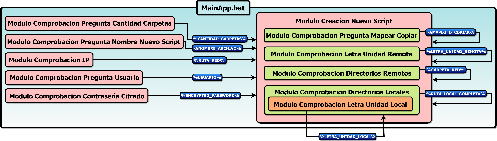

# ScriptCreator Batch
## Descripcion

 Este proyecto se centra en crear un pequeño programa en Windows, con el que podremos crear un script de batch (*.bat) que nos permita realizar mapeos de carpetas remotas de nuestro servidor a unidades locales, asignandoles una letra o copiar los archivos de una carpeta local a una de las carpetas remotas. 

 De esta forma se ha creado una plantilla para crear una tarea/script que realize las tareas, que hemos comentado antes, para cada caso que hayamos creado con esta herramienta. 

 

<table>
  <tr align="center">
    <td><b> Modulos </b></td>
    <td><b> Variable </b></td>
  </tr>
  
  <tr>
    <td> Modulo_Comprobacion_Pregunta_Cantidad_Carpetas.bat </td>
    <td align="center"><b> %CANTIDAD_CARPETAS% </b></td>
  </tr>
  
  <tr>
    <td> Modulo_Comprobacion_Pregunta_Nombre_Nuevo_Script.bat </td>
    <td align="center"><b> %NOMBRE_ARCHIVO% </b></td>
  </tr>
  
  <tr>
    <td> Modulo_Comprobacion_IP.bat </td>
    <td align="center"><b> %RUTA_RED% </b></td>
  </tr>
 
  <tr>
    <td> Modulo_Comprobacion_Pregunta_Usuario.bat </td>
    <td align="center"><b> %USUARIO% </b></td>
  </tr>
  
  <tr>
    <td> Modulo_Comprobacion_Contraseña_Cifrado.bat </td>
    <td align="center"><b> %ENCRYPTED_PASSWORD% </b></td>
  </tr>
  
  <tr>
    <td> Modulo_Comprobacion_Pregunta_Mapear_Copiar.bat </td>
    <td align="center"><b> %MAPEO_O_COPIAR% </b></td>
  </tr>
  
  <tr>
    <td> Modulo_Comprobacion_Letra_Unidad_Remota.bat </td>
    <td align="center"><b> %LETRA_UNIDAD_REMOTA% </b></td>
  </tr>
  
  <tr>
    <td> Modulo_comprobacion_Letra_Unidad_Local.bat </td>
    <td align="center"><b> %LETRA_UNIDAD_LOCAL% </b></td>
  </tr>
  
  <tr>
    <td> Modulo_Comprobacion_Directorios_Remotos.bat </td>
    <td align="center"><b> %CARPETA_RED% </b></td>
  </tr>
  
  <tr>
    <td> Modulo_Comprobacion_Directorios_Locales.bat </td>
    <td align="center"><b> %RUTA_LOCAL_COMPLETA% </b></td>
  </tr>
  
<tr>
  <td> Modulo_Creacion_Nuevo_Script.bat </td>
  <td></td>
</tr>
  
<tr>
  <td> MainApp.bat </td>
  <td></td>
</tr>
  
</table>

 

## Diagrama de los Modulos
  <table>
    <tr>
      <td></td>
    </tr>
  </table>

    
  
## Diagrama de Flujo
  <table>
    <tr>
      <td></td>
    </tr>
  </table>
  
   
